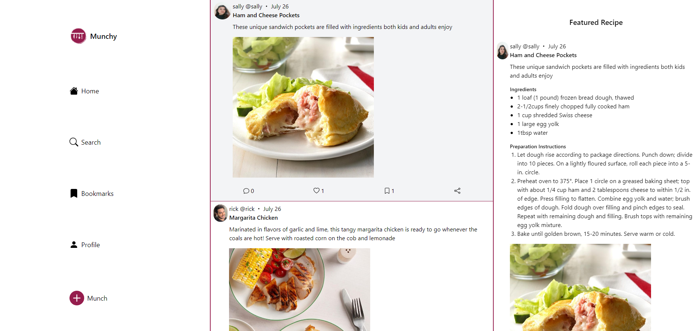

# Munchy

Munchy is a social media web application where users can create posts for their social feed about new recipes that they enjoy which other users can use to find new recipes based on their tastes. It has common social media features such as following/unfollowing a user, liking/unliking posts, and replying to both posts and comments. To create this web application I used the MERN (MongoDB, Express, React, Node) stack along with integration with Cloudinary to handle image uploads and storage. To style this web app I used tailwind css.

